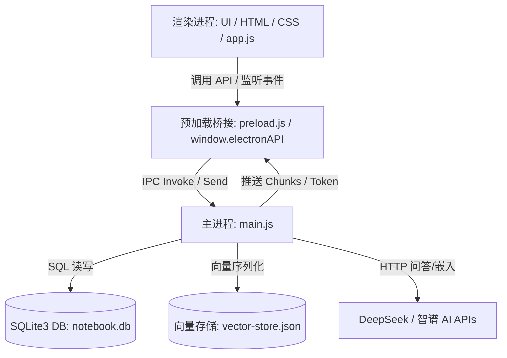

# Notebook Clone 本地桌面端开发与代码规范手册 (SPEC_CODING)

本手册详细规范了从原 Java Web 版项目移植至 **Node.js + Electron + SQLite3** 桌面端的代码逻辑、数据传输、接口定义以及业务实现方式，以便后续的任务推进和维护。

---

## 1. 项目整体架构与数据流 (Architecture & Data Flow)

项目遵循标准的 Electron 经典三层安全架构：



---

## 2. 核心模块代码规范与实现 (Core Modules & Specs)

### 2.1 文档提取与清洗规范 (`extractor.js`) — 混合解析架构 (v1.1.0)

采用 **「LlamaParse 云端优先 + 本地库兜底」** 的双层混合解析架构，大幅提升对复杂 PDF 和 Word 文档的解析质量。

#### A. 解析分发决策树：
- `.txt` / `.md`：本地 UTF-8 直读，无需云端
- `.pdf` / `.docx`：
  - **有 `llamaParse.apiKey` 且网络可用** → 调用 LlamaParse，获取结构化 Markdown
  - **无 Key 或网络异常** → 降级到本地 `pdf-parse` / `mammoth`，输出纯文本

#### B. LlamaParse 云端解析流程（两步异步）：
1. **上传阶段**：`POST /upload`，以 `multipart/form-data` 方式上传文件，返回 `job_id`
2. **轮询阶段**：`GET /job/{id}` 每 5 秒轮询一次，最多等待 300 秒（60 次）
3. **拉取结果**：`GET /job/{id}/result/markdown`，返回结构完整的 Markdown 文本
- 配置参数：`language: "ch_sim"`（简体中文 OCR）、`result_type: "markdown"`
- 对扫描版 PDF（纯图片）同样有效，内置 OCR 引擎会自动识别

#### C. 本地兜底库（Fallback）：
- **Word (.docx)**：使用 `mammoth` 提取纯文字段落（无表格结构）
- **PDF (.pdf)**：使用 `pdf-parse` 提取文字流（无法处理多栏/扫描版）
- 兜底触发条件：`config.json` 中未配置 `llamaParse.apiKey`，或云端调用发生网络异常

#### D. 清洗（Noise Cleaning）规则（对所有来源均适用）：
1. **控制字符处理**：移除所有 `\x00-\x08\x0B\x0C\x0E-\x1F` 的非打印字符（保留 `\n`, `\r`, `\t`）。
2. **水印噪音过滤**：计算每行文字中空格字符比例 `spaceCount / line.length`。如果比例 **大于 40%** 且行长度 **大于等于 12**，判定为疑似水印行，物理剔除。
3. **页眉页脚去重**：扫描文档中非空行出现的频率。如果某行在整篇文档中重复出现 **3 次及以上**，则过滤掉所有该行。
4. **空行规整**：使用正则 `\n{3,}` 将连续 3 个及以上换行符合并为 `\n\n`，并对每行文本首尾进行 `.trim()` 裁剪。

> **注意**：LlamaParse 返回的 Markdown 本身已经很干净，`cleanText()` 主要对本地兜底的输出进行降噪处理。

---

### 2.2 本地 SQLite3 数据库设计 (`database.js`)
数据库存储于 Electron 的用户数据保存路径下（Windows 下为 `%APPDATA%/Roaming/notebook-electron/` 目录），确保程序更新不丢失数据。

#### A. 建表规范与外键关联：
```sql
-- 开启外键自动物理联级删除
PRAGMA foreign_keys = ON;

-- 笔记本表
CREATE TABLE notebooks (
    id INTEGER PRIMARY KEY AUTOINCREMENT,
    name TEXT NOT NULL,
    description TEXT,
    create_time TEXT NOT NULL
);

-- 文档表
CREATE TABLE documents (
    id INTEGER PRIMARY KEY AUTOINCREMENT,
    notebook_id INTEGER NOT NULL,
    title TEXT NOT NULL,
    content TEXT,
    summary TEXT,
    chunk_count INTEGER DEFAULT 0,
    create_time TEXT NOT NULL,
    FOREIGN KEY (notebook_id) REFERENCES notebooks(id) ON DELETE CASCADE
);

-- 聊天历史消息表
CREATE TABLE chat_messages (
    id INTEGER PRIMARY KEY AUTOINCREMENT,
    session_id TEXT NOT NULL,
    role TEXT NOT NULL,
    content TEXT NOT NULL,
    document_id INTEGER,
    notebook_id INTEGER,
    create_time TEXT NOT NULL,
    FOREIGN KEY (document_id) REFERENCES documents(id) ON DELETE CASCADE,
    FOREIGN KEY (notebook_id) REFERENCES notebooks(id) ON DELETE CASCADE
);
```

#### B. 性能优化规范：
- 对频繁用于多轮对话定位的 `session_id` 和 `create_time` 字段建立索引 `idx_chat_session` 和 `idx_chat_created`。
- 对会话历史进行 **轮数控制**：调用 `truncateHistory(sessionId, maxRounds)`。每次对话轮数超过限制时，自动物理删除最早的消息，保持该会话消息总数不超标。

---

### 2.3 轻量级向量数据库引擎 (`vector-store.js`)
为了保持零 C++ 环境依赖度，使用纯 JS 实现内存向量管理。

- **存储结构**：数据最终序列化写入 AppData 目录下的 `vector-store.json`，格式如下：
  ```json
  [
    {
      "id": "doc:1:chunk:0",
      "text": "分块原文内容...",
      "metadata": { "documentId": 1, "documentTitle": "文档名.docx" },
      "embedding": [0.012, -0.05, 0.12, ...]
    }
  ]
  ```
- **Top-K 相似度排序**：当发起 RAG 问答时，调用 Embedding API 获取问题向量。
- **检索算法**：计算两个 512 或 1024 维向量的 **余弦相似度**：
  $$\text{Cosine Similarity} = \frac{\mathbf{A} \cdot \mathbf{B}}{\|\mathbf{A}\| \|\mathbf{B}\|}$$
- **隔离与检索过滤器**：支持传入过滤函数 `filterFunc`。
  - 单文档检索时，过滤 `meta.documentId === docId`。
  - 笔记本级检索时，过滤 `docIds.includes(meta.documentId)`。

---

### 2.4 RAG Pipeline 与问答流 (`rag-service.js`)

#### A. 递归语义分块算法 (Recursive Semantic Text Splitter)
- **切片逻辑**：基于段落与句尾标点进行层次化递归拆分，绝不在一句话或单词中强行中断。
  1. 优先按段落换行（`\n\n+`）切分。
  2. 若段落 Token 数超出 `chunkSize`，则使用正向后瞻正则表达式 `/(?<=[。？！；\n])/` 进一步切分为句子并逐步累加合并，防止句中截断。
- **配置参数**：
  * 分块大小（`chunkSize`）：**512 Token**（使用 `cl100k_base` 编码估算）。
  * 块重叠度（`chunkOverlap`）：**100 Token**，增加相邻分块的上下文粘度。
- **批量请求**：支持批量传入分块进行 Embedding 请求（Batch size = 16），优化网络开销。

#### B. 历史对话智能压缩
在发起 LLM 对话前进行 tokens 预估计算：
- **触发阀值**：对话历史预估总 token 超过 **300K** 且消息数超过 **200 条**。
- **处理方式**：保留最近的 200 条消息为完整内容，将其余旧消息在后台拼接，调用 DeepSeek 大模型总结成一段 `< 300 字` 的历史摘要，作为第一条虚拟助理消息 `【对话摘要】以下是之前对话的概要：...` 注入，以保留长期记忆。

#### C. 大模型流式输出与中断
- 每次对话由前端触发，大模型通过 OpenAI SDK 的 `{ stream: true }` 接口输出。
- 利用 `AbortController` 绑定请求。当用户在前端点击“停止生成”时，触发 `activeAbortController.abort()` 立即中断远程 TCP 网络传输。

---

## 3. IPC 通信协议定义手册 (IPC Channels)

所有的前后端交互必须通过 preload.js 挂载的 `window.electronAPI` 桥接，通道与数据格式映射如下：

### 3.1 笔记本管理
- **获取列表**：`window.electronAPI.getAllNotebooks()`
  - 返回值：`Promise<Result<Array<Notebook>>>`
- **创建**：`window.electronAPI.createNotebook({ name, description })`
  - 返回值：`Promise<Result<Notebook>>`
- **更新**：`window.electronAPI.updateNotebook(id, { name, description })`
  - 返回值：`Promise<Result<Notebook>>`
- **删除**：`window.electronAPI.deleteNotebook(id)`
  - 返回值：`Promise<Result<void>>`（主进程在删除时，会自动清理 `vector-store.json` 里该笔记本下所有文档的向量）

### 3.2 文档管理
- **列表**：`window.electronAPI.getDocumentsByNotebook(notebookId)`
  - 返回值：`Promise<Result<Array<Document>>>`
- **详情**：`window.electronAPI.getDocument(id)`
  - 返回值：`Promise<Result<Document>>`
- **手动新建**：`window.electronAPI.createDocument({ title, content }, notebookId)`
  - 返回值：`Promise<Result<Document>>`（主进程会在保存完后，**异步触发**切片和摘要任务）
- **本地物理文件导入**：`window.electronAPI.uploadDocumentFile(filePath, notebookId, additionalContent)`
  - 返回值：`Promise<Result<Document>>`（主进程在本地解析文件文本，合并 additionalContent 后保存，并**异步触发**切片和摘要任务）
- **删除**：`window.electronAPI.deleteDocument(id)`
  - 返回值：`Promise<Result<void>>`（主进程会自动移除 `vector-store.json` 里的对应分块）

### 3.3 RAG 问答与流式控制
- **流式问答触发**：`window.electronAPI.askStream({ id, type, question, useDocContext })`
  - `type` 可选：`"doc"`（单文档问答）或 `"notebook"`（跨文档问答）
- **停止生成**：`window.electronAPI.abortAsk()`
- **流事件注册**：
  - `window.electronAPI.onChatChunk((text) => {})`：接收流文本碎片。
  - `window.electronAPI.onChatTokenUsage((usage) => {})`：接收最终 `{"prompt": n, "completion": n, "total": n}` 的 Token 信息。
  - `window.electronAPI.onChatEnd(() => {})`：接收正常生成结束标识。
  - `window.electronAPI.onChatError((errMsg) => {})`：接收生成异常信息。

---

## 4. 本地物理文件（Word/PDF/Markdown/TXT）上传与解析规划

为了彻底解决本地物理文件选择及解析流程中的各类异常（例如因为先前删去了原始 `modalFileInput` 节点导致前端 Javascript 在清除/重置输入时报错，或者路径解析时丢失类型信息的问题），我们制定以下重构与优化规划：

### 4.1 页面节点及交互恢复
1. **保留隐藏文件输入框**：在 `renderer/index.html` 的 `docCreateFileSection` 中恢复原版的 `<input type="file" id="modalFileInput" accept=".txt,.md,.docx,.pdf" style="display: none;" onchange="onModalFileSelected(event)">`。
2. **容错重置逻辑**：在 `app.js` 的 `clearSelectedFile()` 与 `resetDocCreateModal()` 中，确保对 `modalFileInput` 进行容错校验，保证即使节点未渲染也绝不抛出 `TypeError` 异常。
3. **混合双通道支持**：
   * **通道 A（Electron 原生选档）**：点击选档框直接触发 `window.electronAPI.selectLocalFile()`。此时由主进程调用 Windows 原生 `dialog.showOpenDialog` 获取绝对物理路径（返回字符串），安全且体验优异。
   * **通道 B（HTML5 选档兼容）**：双击或备用点击触发隐藏的 `modalFileInput.click()`。在获取到 `File` 对象后，利用 Electron 独有的 `file.path` 属性直接拿到该文件在 Windows 系统上的真实物理绝对路径。

### 4.2 数据层桥接适配
无论是通道 A 还是通道 B，最终获取的均是文件的本地物理路径（如 `D:\Docs\test.pdf`）。
- 前端拿到路径后，将其赋给全局变量 `selectedFile`（保存绝对路径字符串）。
- 当点击“创建”文档时，前端调用 `uploadDocumentFileAPI(selectedFile, notebookId, additionalContent)`。
- 主进程通过 `ipcMain.handle('document:upload-file')` 接收该物理绝对路径，使用 `extractor.js` 在主进程完成文本的就地提取和级联清洗。

---

## 5. 项目改进与迭代记录 (Changelog)

为了更好地追踪项目每次迭代修复的内容与重构细节，项目根目录下建立了 `docs/` 文件夹。
每一次的改进细节（例如 Bug 修复、功能新增等）将通过独立的 `.md` 文档记录在 `docs/` 文件夹内，从而形成可供学习和回溯的技术沉淀。

当前已有记录：
- `docs/v1.0.1_streaming_markdown_fix.md`: 修复了问答过程中大模型流式输出 Markdown 时在界面上显示“奇怪符号”的视觉 Bug，并引入了实时 HTML 解析与安全渲染机制。
- `docs/v1.1.0_llamaparse_integration.md`: 升级文档提取能力，引入 LlamaParse 云端智能解析服务，实现「云端优先+本地兜底」的混合解析架构，解决复杂 PDF 表格乱序、扫描版 PDF 无法识别等问题。
- `docs/v1.1.1_llamaparse_connection_fix.md`: 修复了 LlamaParse 轮询期间由于 Node.js 18 的 Keep-Alive 超时复用导致的 `fetch failed` 错误，改用 Connection: close 请求头强制每次关闭连接。
- `docs/v1.1.2_llamaparse_dns_and_logging.md`: 解决 LlamaParse 间歇性 `fetch failed` 错误，全局设置 DNS 优先解析 IPv4，并优化了错误日志的 `cause` 输出以便定位底层网络问题。
- `docs/v1.1.3_llamaparse_retry_mechanism.md`: 引入 `fetchWithRetry` 自动重试机制，应对由于高频握手或网络抖动造成的 `ECONNRESET` / TLS 握手重置错误，恢复默认 Keep-Alive 长连接提高传输效率。
- `docs/v1.2.0_spring_test_endpoint_cleanup.md`: 清理 Spring Boot 版本遗留的调试控制器与匿名 `/test/**` 放行规则，避免模型额度滥用和跨用户向量内容暴露。
- `docs/v1.2.1_spring_user_controller_cleanup.md`: 删除已被认证流程替代的 `/api/users/**` 学习接口，消除跨用户查询、任意删除和绕过 BCrypt 保存密码的问题。
- `docs/v1.2.2_auth_security_automated_tests.md`: 以 `/api/auth/me` 为例引入 Spring MVC 安全切片测试，验证匿名放行、JWT 身份解析和 401 拦截边界。
- `docs/v1.2.3_ownership_authorization_tests.md`: 使用真实 JWT 安全链与 Mock 数据层验证笔记本、文档的用户归属校验，防止跨用户读取和删除。
- `docs/v1.2.4_test_learning_comments.md`: 为两组安全自动化测试补充初学者注释，解释测试切片、Mock、AAA 结构和越权场景的副作用验证。
- `docs/v1.2.5_auth_service_unit_tests.md`: 为 AuthService 增加纯单元测试，验证 BCrypt 密码加密、重复注册拦截和登录密码校验。
- `docs/v1.2.6_document_extract_unit_tests.md`: 通过公开文件提取入口验证 TXT/Markdown/DOCX 解析、控制字符清理、重复页眉与水印过滤及非法输入处理。
- `docs/v1.2.7_chat_history_service_tests.md`: 为对话历史服务增加用户会话隔离、角色转换、保存顺序、超长截断和过期清理测试。
- `docs/v1.2.8_notebook_deletion_consistency_tests.md`: 验证删除笔记本时先逐个清理所属文档向量，再清理历史并删除数据库记录，避免孤儿向量残留。
- `docs/v1.2.9_document_upload_consistency_tests.md`: 验证文档上传在解析、保存及异步向量化失败时的副作用边界，并为向量失败增加状态标记与补偿清理。
- `docs/v1.3.0_electron_automated_tests.md`: 使用 Node 内置测试框架为 Electron 版增加文本清洗、临时向量库和内存 SQLite 自动化测试，不接触真实数据与外部 API。
