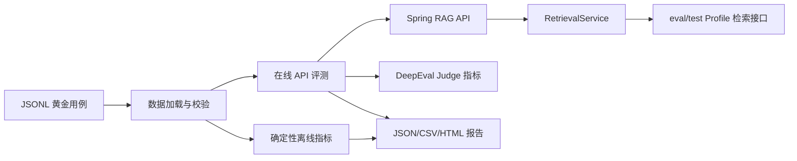

# v1.4.0 RAG-Eval-Lab 第一阶段设计

## 1. 背景与目标

现有 Spring Boot 版已经具备 RAG 检索、JWT、多用户隔离、引用标记和自动化测试，
Electron 版也具备本地向量检索与 Node.js 测试。第一阶段在
`notebook-clone/rag-eval-lab/` 新增独立 Python 评测模块，补齐 pytest、确定性质量指标、
DeepEval 适配、结构化报告和 GitHub Actions 展示能力。

该目录靠近被测 Spring RAG 服务，又保持 Python 依赖与 Java 构建隔离；Electron 仍作为
CI 中的独立回归套件，不把 Python 依赖放入桌面端。

## 2. 强制安全边界

- 默认 `pytest` 只运行离线用例，不访问网络、不启动 Spring、不调用任何模型。
- 在线用例统一标记 `online`；只有显式执行 `pytest -m online` 才会进入。
- 缺少服务地址、JWT 或显式启用开关时，在线用例必须 `skip`。
- DeepEval 再增加独立的显式开关和 Judge 配置；缺少任一配置时必须 `skip`。
- API Key 只从环境变量读取；`.env.example` 只放占位符，代码不读取或打印现有
  `config.json`、`application.properties`。
- 测试资料全部是仓库内自带的虚构公开资料，不读取用户文档。
- 报告输出到被忽略的 `reports/`；仓库只保留脱敏的 `sample-report.json`。

## 3. 架构

Python 模块按职责拆分为数据模型、指标、HTTP 客户端、DeepEval 适配和报告器。pytest
使用 fixture 统一加载用例，使用参数化测试逐条显示 `case_id`。

## 4. 测试数据

固定资料覆盖产品手册、售后政策、账户安全三篇短文，不依赖私人内容。黄金数据使用
JSONL，每条至少包含：

- `case_id`
- `question`
- `expected_answer` 或 `expected_keywords`
- `expected_source`
- `forbidden_claims`（可选）
- `category`：`factual`、`citation`、`no_answer`、`multi_document`、
  `access_control`、`fallback`
- `actual_answer`、`retrieval_context`：离线可重复的基准输出与上下文

第一阶段控制在约 14 条有代表性的用例，避免用重复改写堆数量。

## 5. 确定性指标与通过规则

- HTTP 成功：在线响应为 2xx，且业务响应 `code=200`。
- 非空回答：去空白后仍有内容。
- 关键词命中率：命中的期望关键词数 / 期望关键词总数。
- 引用标记：回答中存在 `[N]`。
- 引用标题：期望来源标题出现在回答引用区。
- 明确拒答：`no_answer` 用例命中约定拒答短语，且不包含禁止断言。
- 响应耗时：记录毫秒值并按阈值判断。
- Token：接口返回时记录；没有返回时为 `null`，不能伪造。
- 用户隔离：使用另一用户 JWT 请求不属于自己的资源，必须被拒绝且不能返回检索块。

报告汇总总数、通过/失败数、通过率、各指标平均值、P50/P95、失败类型，以及失败用例的
`case_id`、问题、实际回答和原因。

## 6. DeepEval 适配

在线适配包含以下指标：

- Answer Relevancy
- Faithfulness
- Contextual Precision
- Contextual Recall

DeepEval 采用懒加载：未安装可选依赖时不影响离线测试。执行 Judge 前必须同时满足显式
启用开关、模型名称和 Key 配置，防止默认回退到其他付费模型。

当前 `AiChatService` 把 `retrieveRelevantChunks` 设为私有方法，普通问答 API 只返回文本，
无法把真实 retrieval context 交给 DeepEval。因此把检索职责小范围抽取到
`RetrievalService`，问答服务复用它；另加 `/api/eval/retrieval`：

- Controller 仅在 `eval` 或 `test` Profile 注册；
- 继续经过现有 Spring Security/JWT 过滤链；
- 先按当前用户校验文档或笔记本归属；
- 只返回排名、分块文本和必要元数据，不返回向量、密钥或其他用户资料；
- 默认生产 Profile 根本不存在该路由；
- 用 MockMvc 验证匿名访问、越权访问、合法访问和 Profile 边界。

## 7. CI 设计

普通 GitHub Actions 在 Pull Request / push 中并行执行：

1. `notebook-clone/mvnw.cmd test`（Windows 本地）对应 CI 的 Maven test；
2. `notebook-electron/npm test`；
3. `rag-eval-lab` 的 Python 离线 `pytest -m "not online"`。

在线评测只允许 `workflow_dispatch` 手动触发，并从 GitHub Secrets 注入所需环境变量；
普通 PR 永不运行在线 Judge。

## 8. 验收标准

- Python 语法检查和离线 pytest 全通过。
- 无在线配置时，`pytest -m online` 明确跳过。
- Spring 原有测试及新增安全测试全通过。
- Electron 原有测试全通过。
- 测试只使用 Mock、内存数据库、临时目录和固定资料。
- `git diff --check` 通过，报告目录、缓存、虚拟环境和 `.env` 被忽略。

## 9. 第一阶段不做

不开发复杂前端、用例管理后台、多模型大规模对比、自动修复、Kubernetes 或 Jenkins。
在线数据自动建库和异步向量化的稳定编排留到下一阶段；MVP 通过环境变量接收已经准备好
的测试资源 ID 和 JWT，并在缺少条件时安全跳过。
